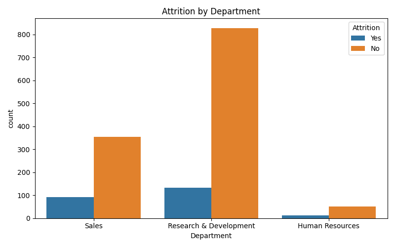
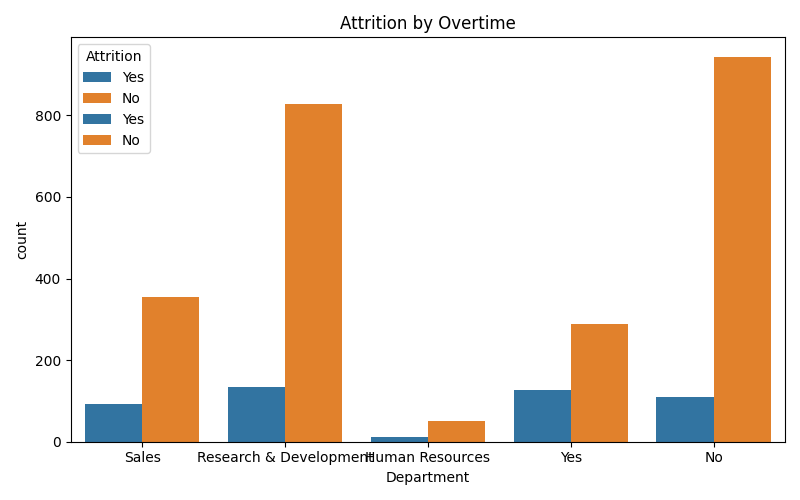

# HR Employee Attrition Analysis

## Project Overview
تحليل بيانات الموظفين لشركة وهمية مقدمة من IBM على Kaggle. الهدف هو فهم الأسباب الرئيسية التي تؤدي إلى استقالة الموظفين ومساعدة الإدارة على تقليل نسبة الـ Attrition.

## Dataset
- **Source**: IBM HR Analytics Employee Attrition & Performance Dataset - Kaggle
- **Rows**: 1470 موظف
- **Columns**: 35 عمود مثل Department, OverTime, JobSatisfaction, MonthlyIncome

## Data Cleaning
1. فحصت القيم الناقصة: **0 missing values** في جميع الأعمدة
2. تأكدت من أنواع البيانات وصحة الأسماء
3. الداتا جاهزة للتحليل مباشرة

## Key Insights

### 1. نسبة الاستقالة العامة
- نسبة الاستقالة الكلية: **16.12%**
- يعني تقريباً 1 من كل 6 موظفين يترك الشركة

### 2. الاستقالة حسب القسم
- قسم **Sales** عنده أعلى نسبة استقالة مقارنة بـ HR و R&D
- السبب المحتمل: ضغط المبيعات والـ Targets العالية

### 3. تأثير العمل الإضافي OverTime
- الموظفين اللي يشتغلون Overtime احتمال تركهم للشركة أعلى بمرتين
- Work-Life Balance عامل أساسي في قرار الاستقالة

## Visualizations

## Tools Used
- **Python**: Pandas, Matplotlib, Seaborn
- **VS Code** للتحليل والبرمجة
- **GitHub** لرفع المشروع

## How to Run
1. نزّل ملف `WA_Fn-UseC_-HR-Employee-Attrition.csv` وحطه بنفس المجلد
2. شغّل `hr_cleaning.py`
3. بتطلع لك النتائج والصور في نفس المجلد

## Skills Demonstrated
- Data Cleaning & Validation
- Exploratory Data Analysis EDA
- Data Visualization
- Business Insight Extraction